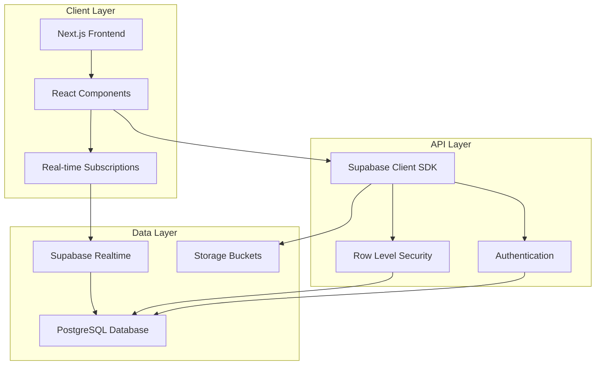
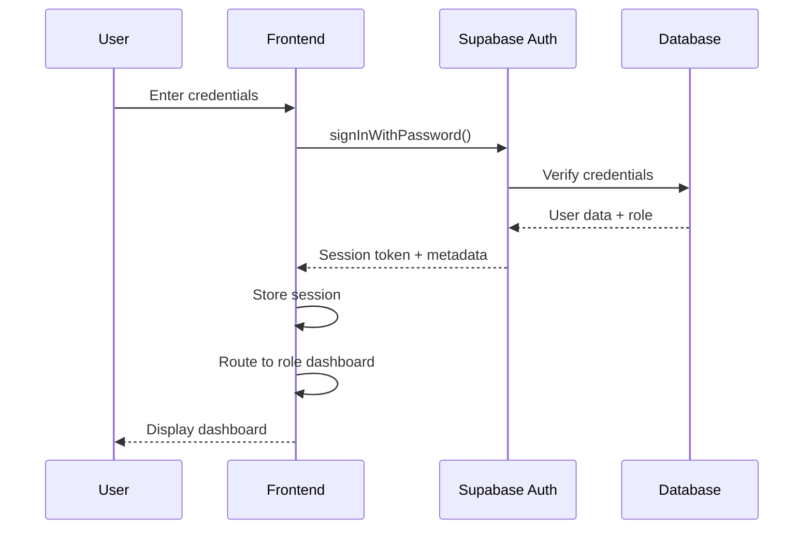

# Design Document: Narxoz College Management System

## Overview

The Narxoz College Management System is a full-stack web application built with Next.js 14 (App Router), TypeScript, and Supabase. The system provides a role-based platform for managing academic operations at Narxoz College, supporting three distinct user roles: Administrator, Teacher, and Student.

The architecture follows a modern serverless approach with:
- **Frontend**: Next.js 14 with TypeScript, React Server Components, and client-side interactivity
- **Backend**: Supabase (PostgreSQL database, authentication, real-time subscriptions, storage)
- **Styling**: Custom CSS with gradient design system, responsive layouts
- **State Management**: React hooks with real-time synchronization via Supabase subscriptions
- **Authentication**: Supabase Auth with role-based access control (RBAC)

The system emphasizes real-time data synchronization, ensuring that all users see updates within 2 seconds without manual page refreshes. This is achieved through Supabase's real-time subscriptions and PostgreSQL's LISTEN/NOTIFY mechanism.

## Architecture

### High-Level Architecture



### Technology Stack

**Frontend:**
- Next.js 14 (App Router with TypeScript)
- React 18 with Server Components
- Custom CSS with gradient design system
- Dynamic imports for performance optimization
- React Icons for UI elements

**Backend:**
- Supabase PostgreSQL database
- Supabase Authentication
- Supabase Realtime (WebSocket subscriptions)
- Supabase Storage for file uploads
- Row Level Security (RLS) policies

**Deployment:**
- Vercel (frontend hosting)
- Supabase Cloud (backend services)

### Authentication Flow



### Real-Time Synchronization Architecture

The system uses Supabase Realtime to provide instant updates across all connected clients:

1. **Database Changes**: Any INSERT, UPDATE, or DELETE operation on enabled tables
2. **PostgreSQL Trigger**: Automatically fires NOTIFY event
3. **Supabase Realtime**: Broadcasts change to all subscribed clients via WebSocket
4. **Client Subscription**: React components receive updates and re-render
5. **UI Update**: Changes appear within 2 seconds without page refresh

**Enabled Tables for Realtime:**
- `shop_products`
- `students`
- `teachers`
- `grades`
- `groups`
- `news` (to be added)
- `schedule` (to be added)
- `library_books` (to be added)
- `materials` (to be added)

## Components and Interfaces

### Core Components

#### 1. UniversalLayout Component

**Purpose**: Provides consistent layout, navigation, and authentication wrapper for all pages.

**Props:**
```typescript
interface UniversalLayoutProps {
  children: React.ReactNode;
  role: 'student' | 'teacher' | 'admin';
}
```

**Responsibilities:**
- Authentication verification
- Role-based access control
- Navigation rendering (PillNav)
- Language switching (Kazakh/Russian)
- Logout functionality
- Decorative background elements

#### 2. PillNav Component

**Purpose**: Animated navigation bar with pill-style active indicator.

**Props:**
```typescript
interface PillNavProps {
  logo: string;
  logoAlt: string;
  items: NavItem[];
  activeHref: string;
  baseColor: string;
  pillColor: string;
  hoveredPillTextColor: string;
  pillTextColor: string;
  userName?: string;
  onLogout: () => void;
  currentLang: Language;
  onLanguageChange: (lang: string) => void;
}

interface NavItem {
  label: string;
  href: string;
}
```

#### 3. Carousel Component

**Purpose**: Interactive carousel for displaying quick-access cards on dashboards.

**Props:**
```typescript
interface CarouselProps {
  items: CarouselItem[];
  baseWidth: number;
  autoplay?: boolean;
  autoplayDelay?: number;
  pauseOnHover?: boolean;
  loop?: boolean;
}

interface CarouselItem {
  title: string;
  description: string;
  id: number;
  icon: React.ReactNode;
  href: string;
}
```

### Page Components

#### Administrator Pages

1. **Admin Dashboard** (`/admin`)
   - Statistics overview (students, teachers, groups, subjects)
   - Recent actions log
   - Attention items (alerts, pending tasks)
   - Quick access carousel

2. **User Management** (`/admin/users`)
   - List all users with roles
   - Add/remove users
   - Assign/change roles
   - Block/unblock users

3. **Student Management** (`/admin/students`)
   - View all students
   - Add/edit/delete students
   - Assign students to groups
   - View student statistics

4. **Teacher Management** (`/admin/teachers`)
   - View all teachers
   - Add/edit/delete teachers
   - Assign subjects and groups
   - View teacher workload

5. **Schedule Management** (`/admin/schedule`)
   - Create/edit/delete schedule entries
   - Assign teachers and groups
   - View weekly/monthly schedules
   - Conflict detection

6. **News Management** (`/admin/news`)
   - Create/edit/delete news articles
   - Publish/unpublish articles
   - Rich text editor
   - Image uploads

7. **Shop Management** (`/admin/shop`)
   - Add/edit/delete products
   - Update availability status
   - Manage categories
   - View product statistics

8. **Library Management** (`/admin/library`)
   - Add/edit/delete books
   - Update availability status
   - Manage categories
   - Track borrowing history

9. **Settings** (`/admin/settings`)
   - Grade submission window control
   - System configuration
   - Audit log viewer
   - Backup/restore

#### Teacher Pages

1. **Teacher Dashboard** (`/teacher`)
   - Assigned subjects and groups
   - Today's schedule
   - Recent grade submissions
   - Quick access carousel

2. **Students View** (`/teacher/students`)
   - View assigned students
   - Filter by group
   - View student profiles
   - Contact information

3. **Grades Management** (`/teacher/grades`)
   - Submit grades for students
   - View grade history
   - Filter by subject/group
   - Grade submission status indicator

4. **Materials Management** (`/teacher/materials`)
   - Upload teaching materials
   - View student submissions
   - Organize by subject
   - Download files

5. **Profile** (`/teacher/profile`)
   - View/edit personal information
   - View assigned subjects and groups
   - Change password

#### Student Pages

1. **Student Dashboard** (`/student`)
   - Statistics (GPA, attendance, subjects, assignments)
   - Today's schedule
   - Quick access carousel

2. **Schedule** (`/student/schedule`)
   - Weekly schedule view
   - Filter by day
   - View teacher and room information

3. **Grades** (`/student/grades`)
   - View all grades by subject
   - GPA calculation
   - Grade breakdown (lecture, SRSP, SRS, session)

4. **News** (`/student/news`)
   - View all published news
   - Filter by date/category
   - Read full articles

5. **Library** (`/student/library`)
   - Browse available books
   - View book status (available/occupied)
   - Search and filter

6. **Shop** (`/student/shop`)
   - Browse products
   - View availability
   - Shopping cart (future feature)

7. **Materials Exchange** (`/student/exchange`)
   - Upload homework/projects
   - View teacher materials
   - Download files
   - Filter by subject

8. **Profile** (`/student/profile`)
   - View/edit personal information
   - View group information
   - Change password

### Authentication Library

**File**: `lib/auth.ts`

```typescript
// Core authentication functions
export async function signIn(email: string, password: string): Promise<AuthResult>
export async function signUp(email: string, password: string, metadata: UserMetadata): Promise<AuthResult>
export async function signOut(): Promise<void>
export async function getCurrentUser(): Promise<User | null>
export async function resetPassword(email: string): Promise<void>
export async function updatePassword(newPassword: string): Promise<void>

interface UserMetadata {
  name: string;
  role: 'student' | 'teacher' | 'admin';
  group?: string; // for students
  subjects?: string[]; // for teachers
}

interface AuthResult {
  user: User | null;
  error: Error | null;
}
```

### Translation System

**File**: `lib/translations.ts`

Provides multi-language support (Kazakh and Russian) for all UI elements.

```typescript
export type Language = 'kz' | 'ru';
export type TranslationKey = keyof typeof translations.ru;

export const translations: Record<Language, Record<string, string>>;
```

## Data Models

### Database Schema

#### Users Table (Supabase Auth)

Managed by Supabase Authentication service.

```sql
-- auth.users (managed by Supabase)
{
  id: UUID PRIMARY KEY,
  email: TEXT UNIQUE NOT NULL,
  encrypted_password: TEXT NOT NULL,
  email_confirmed_at: TIMESTAMPTZ,
  raw_user_meta_data: JSONB, -- Contains: { name, role, ... }
  created_at: TIMESTAMPTZ,
  updated_at: TIMESTAMPTZ
}
```

**Metadata Structure:**
```typescript
{
  name: string;
  role: 'student' | 'teacher' | 'admin';
  group?: string; // for students
  subjects?: string[]; // for teachers
}
```

#### Students Table

```sql
CREATE TABLE public.students (
  id BIGSERIAL PRIMARY KEY,
  user_id UUID REFERENCES auth.users(id) ON DELETE CASCADE,
  name TEXT NOT NULL,
  email TEXT NOT NULL UNIQUE,
  phone TEXT,
  group_name TEXT NOT NULL,
  gpa DECIMAL(3,2) DEFAULT 0,
  attendance INTEGER DEFAULT 0,
  status TEXT DEFAULT 'active',
  created_at TIMESTAMPTZ DEFAULT NOW(),
  updated_at TIMESTAMPTZ DEFAULT NOW()
);
```

**TypeScript Interface:**
```typescript
interface Student {
  id: number;
  user_id: string;
  name: string;
  email: string;
  phone?: string;
  group_name: string;
  gpa: number;
  attendance: number;
  status: 'active' | 'inactive' | 'graduated';
  created_at: string;
  updated_at: string;
}
```

#### Teachers Table

```sql
CREATE TABLE public.teachers (
  id BIGSERIAL PRIMARY KEY,
  user_id UUID REFERENCES auth.users(id) ON DELETE CASCADE,
  name TEXT NOT NULL,
  email TEXT NOT NULL UNIQUE,
  phone TEXT,
  subjects TEXT[] NOT NULL,
  groups TEXT[] NOT NULL,
  experience INTEGER DEFAULT 0,
  degree TEXT,
  created_at TIMESTAMPTZ DEFAULT NOW(),
  updated_at TIMESTAMPTZ DEFAULT NOW()
);
```

**TypeScript Interface:**
```typescript
interface Teacher {
  id: number;
  user_id: string;
  name: string;
  email: string;
  phone?: string;
  subjects: string[];
  groups: string[];
  experience: number;
  degree?: string;
  created_at: string;
  updated_at: string;
}
```

#### Groups Table

```sql
CREATE TABLE public.groups (
  id BIGSERIAL PRIMARY KEY,
  name TEXT NOT NULL UNIQUE,
  full_name TEXT NOT NULL,
  course INTEGER NOT NULL,
  curator TEXT,
  created_at TIMESTAMPTZ DEFAULT NOW()
);
```

**TypeScript Interface:**
```typescript
interface Group {
  id: number;
  name: string;
  full_name: string;
  course: number;
  curator?: string;
  created_at: string;
}
```

#### Grades Table

```sql
CREATE TABLE public.grades (
  id BIGSERIAL PRIMARY KEY,
  student_id BIGINT REFERENCES public.students(id) ON DELETE CASCADE,
  teacher_id BIGINT REFERENCES public.teachers(id) ON DELETE SET NULL,
  subject TEXT NOT NULL,
  grade_type TEXT NOT NULL,
  grade INTEGER NOT NULL CHECK (grade >= 0 AND grade <= 100),
  comment TEXT,
  created_at TIMESTAMPTZ DEFAULT NOW(),
  updated_at TIMESTAMPTZ DEFAULT NOW()
);
```

**TypeScript Interface:**
```typescript
interface Grade {
  id: number;
  student_id: number;
  teacher_id?: number;
  subject: string;
  grade_type: 'lecture' | 'srsp' | 'srs' | 'midterm' | 'final';
  grade: number;
  comment?: string;
  created_at: string;
  updated_at: string;
}
```

#### Shop Products Table

```sql
CREATE TABLE public.shop_products (
  id BIGSERIAL PRIMARY KEY,
  name TEXT NOT NULL,
  category TEXT NOT NULL,
  price INTEGER NOT NULL,
  image TEXT NOT NULL,
  description TEXT NOT NULL,
  in_stock BOOLEAN DEFAULT true,
  rating DECIMAL(2,1) DEFAULT 0,
  reviews INTEGER DEFAULT 0,
  created_at TIMESTAMPTZ DEFAULT NOW(),
  updated_at TIMESTAMPTZ DEFAULT NOW()
);
```

**TypeScript Interface:**
```typescript
interface ShopProduct {
  id: number;
  name: string;
  category: string;
  price: number;
  image: string;
  description: string;
  in_stock: boolean;
  rating: number;
  reviews: number;
  created_at: string;
  updated_at: string;
}
```

#### News Table (To Be Created)

```sql
CREATE TABLE public.news (
  id BIGSERIAL PRIMARY KEY,
  title TEXT NOT NULL,
  content TEXT NOT NULL,
  author_id UUID REFERENCES auth.users(id) ON DELETE SET NULL,
  author_name TEXT NOT NULL,
  published BOOLEAN DEFAULT false,
  image_url TEXT,
  category TEXT,
  created_at TIMESTAMPTZ DEFAULT NOW(),
  updated_at TIMESTAMPTZ DEFAULT NOW()
);
```

**TypeScript Interface:**
```typescript
interface News {
  id: number;
  title: string;
  content: string;
  author_id?: string;
  author_name: string;
  published: boolean;
  image_url?: string;
  category?: string;
  created_at: string;
  updated_at: string;
}
```

#### Schedule Table (To Be Created)

```sql
CREATE TABLE public.schedule (
  id BIGSERIAL PRIMARY KEY,
  day_of_week INTEGER NOT NULL CHECK (day_of_week >= 0 AND day_of_week <= 6),
  start_time TIME NOT NULL,
  end_time TIME NOT NULL,
  subject TEXT NOT NULL,
  teacher_id BIGINT REFERENCES public.teachers(id) ON DELETE CASCADE,
  group_name TEXT NOT NULL,
  room TEXT NOT NULL,
  created_at TIMESTAMPTZ DEFAULT NOW(),
  updated_at TIMESTAMPTZ DEFAULT NOW()
);
```

**TypeScript Interface:**
```typescript
interface Schedule {
  id: number;
  day_of_week: number; // 0 = Monday, 6 = Sunday
  start_time: string;
  end_time: string;
  subject: string;
  teacher_id: number;
  group_name: string;
  room: string;
  created_at: string;
  updated_at: string;
}
```

#### Library Books Table (To Be Created)

```sql
CREATE TABLE public.library_books (
  id BIGSERIAL PRIMARY KEY,
  title TEXT NOT NULL,
  author TEXT NOT NULL,
  isbn TEXT UNIQUE,
  category TEXT NOT NULL,
  description TEXT,
  cover_url TEXT,
  status TEXT DEFAULT 'available',
  borrowed_by BIGINT REFERENCES public.students(id) ON DELETE SET NULL,
  borrowed_at TIMESTAMPTZ,
  due_date TIMESTAMPTZ,
  created_at TIMESTAMPTZ DEFAULT NOW(),
  updated_at TIMESTAMPTZ DEFAULT NOW()
);
```

**TypeScript Interface:**
```typescript
interface LibraryBook {
  id: number;
  title: string;
  author: string;
  isbn?: string;
  category: string;
  description?: string;
  cover_url?: string;
  status: 'available' | 'occupied' | 'reserved';
  borrowed_by?: number;
  borrowed_at?: string;
  due_date?: string;
  created_at: string;
  updated_at: string;
}
```

#### Materials Table (To Be Created)

```sql
CREATE TABLE public.materials (
  id BIGSERIAL PRIMARY KEY,
  title TEXT NOT NULL,
  description TEXT,
  subject TEXT NOT NULL,
  category TEXT NOT NULL,
  file_url TEXT NOT NULL,
  file_name TEXT NOT NULL,
  file_size INTEGER NOT NULL,
  uploader_id UUID REFERENCES auth.users(id) ON DELETE CASCADE,
  uploader_name TEXT NOT NULL,
  uploader_role TEXT NOT NULL,
  group_name TEXT,
  created_at TIMESTAMPTZ DEFAULT NOW()
);
```

**TypeScript Interface:**
```typescript
interface Material {
  id: number;
  title: string;
  description?: string;
  subject: string;
  category: 'notes' | 'homework' | 'projects' | 'exams' | 'teaching';
  file_url: string;
  file_name: string;
  file_size: number;
  uploader_id: string;
  uploader_name: string;
  uploader_role: 'student' | 'teacher';
  group_name?: string;
  created_at: string;
}
```

#### Settings Table (To Be Created)

```sql
CREATE TABLE public.settings (
  id BIGSERIAL PRIMARY KEY,
  key TEXT NOT NULL UNIQUE,
  value JSONB NOT NULL,
  description TEXT,
  updated_at TIMESTAMPTZ DEFAULT NOW()
);
```

**TypeScript Interface:**
```typescript
interface Setting {
  id: number;
  key: string;
  value: any;
  description?: string;
  updated_at: string;
}

// Specific settings
interface GradeSubmissionSetting {
  enabled: boolean;
  deadline?: string; // ISO timestamp
  message?: string;
}
```

#### Audit Log Table (To Be Created)

```sql
CREATE TABLE public.audit_log (
  id BIGSERIAL PRIMARY KEY,
  user_id UUID REFERENCES auth.users(id) ON DELETE SET NULL,
  user_email TEXT NOT NULL,
  user_role TEXT NOT NULL,
  action TEXT NOT NULL,
  table_name TEXT,
  record_id BIGINT,
  old_data JSONB,
  new_data JSONB,
  ip_address TEXT,
  user_agent TEXT,
  created_at TIMESTAMPTZ DEFAULT NOW()
);
```

**TypeScript Interface:**
```typescript
interface AuditLog {
  id: number;
  user_id?: string;
  user_email: string;
  user_role: string;
  action: 'create' | 'update' | 'delete' | 'login' | 'logout';
  table_name?: string;
  record_id?: number;
  old_data?: any;
  new_data?: any;
  ip_address?: string;
  user_agent?: string;
  created_at: string;
}
```

### Row Level Security (RLS) Policies

All tables have RLS enabled with the following policy patterns:

**Read Access (SELECT):**
- All authenticated users can read data from all tables
- Policy: `FOR SELECT USING (true)`

**Write Access (INSERT, UPDATE, DELETE):**
- **Administrators**: Full access to all tables
- **Teachers**: Can insert/update grades for their assigned students
- **Students**: No write access to system tables
- **All Users**: Can update their own profile information

**Example Policies:**

```sql
-- Shop products - all can read, only admin can write
CREATE POLICY "shop_select_policy" ON public.shop_products 
  FOR SELECT USING (true);

CREATE POLICY "shop_admin_policy" ON public.shop_products 
  FOR ALL USING (
    (SELECT raw_user_meta_data->>'role' FROM auth.users WHERE id = auth.uid()) = 'admin'
  );

-- Grades - all can read, teachers and admins can write
CREATE POLICY "grades_select_policy" ON public.grades 
  FOR SELECT USING (true);

CREATE POLICY "grades_teacher_policy" ON public.grades 
  FOR ALL USING (
    (SELECT raw_user_meta_data->>'role' FROM auth.users WHERE id = auth.uid()) IN ('teacher', 'admin')
  );
```

### Real-Time Subscriptions

Tables enabled for real-time updates:

```sql
ALTER PUBLICATION supabase_realtime ADD TABLE public.shop_products;
ALTER PUBLICATION supabase_realtime ADD TABLE public.students;
ALTER PUBLICATION supabase_realtime ADD TABLE public.teachers;
ALTER PUBLICATION supabase_realtime ADD TABLE public.grades;
ALTER PUBLICATION supabase_realtime ADD TABLE public.groups;
ALTER PUBLICATION supabase_realtime ADD TABLE public.news;
ALTER PUBLICATION supabase_realtime ADD TABLE public.schedule;
ALTER PUBLICATION supabase_realtime ADD TABLE public.library_books;
ALTER PUBLICATION supabase_realtime ADD TABLE public.materials;
```

**Client-Side Subscription Pattern:**

```typescript
useEffect(() => {
  const channel = supabase
    .channel('table-changes')
    .on(
      'postgres_changes',
      { event: '*', schema: 'public', table: 'table_name' },
      (payload) => {
        // Handle INSERT, UPDATE, DELETE
        console.log('Change received!', payload);
        // Update local state
      }
    )
    .subscribe();

  return () => {
    supabase.removeChannel(channel);
  };
}, []);
```


## Correctness Properties

*A property is a characteristic or behavior that should hold true across all valid executions of a system—essentially, a formal statement about what the system should do. Properties serve as the bridge between human-readable specifications and machine-verifiable correctness guarantees.*

### Authentication and Authorization Properties

**Property 1: Valid credentials grant role-appropriate access**
*For any* valid user credentials (email, password, role), authenticating with those credentials should grant access to features appropriate for that role and deny access to features for other roles.
**Validates: Requirements 1.1**

**Property 2: Invalid credentials are rejected**
*For any* invalid credentials (wrong email, wrong password, or non-existent user), authentication attempts should be rejected with an appropriate error message.
**Validates: Requirements 1.2**

**Property 3: Password recovery sends reset links**
*For any* registered user email, requesting password recovery should result in a password reset link being sent to that email address.
**Validates: Requirements 1.3**

**Property 4: Role-based access control enforcement**
*For any* protected resource and any user role, the system should only allow access if the user's role has permission for that resource, and deny access otherwise.
**Validates: Requirements 1.6, 14.3**

**Property 5: Session isolation by role**
*For any* two users with different roles, their authentication sessions should be completely isolated with no shared state or cross-contamination.
**Validates: Requirements 1.4**

### User Management Properties

**Property 6: User creation with correct role**
*For any* user data (name, email, password) and role (student, teacher, admin), creating a user account should store all provided data and assign the specified role with corresponding permissions.
**Validates: Requirements 2.1**

**Property 7: User deletion revokes access**
*For any* existing user, deleting that user should immediately revoke all access permissions and prevent authentication with their credentials.
**Validates: Requirements 2.2**

**Property 8: Role assignment updates permissions**
*For any* user and any role, assigning that role to the user should immediately update their permissions to match the new role's permission set.
**Validates: Requirements 2.3, 2.4**

**Property 9: User blocking prevents authentication**
*For any* user, blocking that user should prevent them from authenticating until they are unblocked, regardless of credential validity.
**Validates: Requirements 2.6**

### Schedule Management Properties

**Property 10: Schedule creation stores all data**
*For any* schedule entry (date, time, subject, teacher, group, room), creating the entry should store all provided fields and make them retrievable.
**Validates: Requirements 3.1**

**Property 11: Schedule filtering by teacher**
*For any* teacher and any set of schedule entries, viewing the schedule as that teacher should display only entries where the teacher is assigned, and exclude all others.
**Validates: Requirements 3.4**

**Property 12: Schedule filtering by student group**
*For any* student and any set of schedule entries, viewing the schedule as that student should display only entries for their group, and exclude all others.
**Validates: Requirements 3.5**

**Property 13: Schedule chronological ordering**
*For any* set of schedule entries, displaying the schedule should present entries sorted by date and time in chronological order.
**Validates: Requirements 3.6**

### News Management Properties

**Property 14: News creation stores all data**
*For any* news article (title, content, author, date), creating the article should store all provided fields and make them retrievable.
**Validates: Requirements 4.1**

**Property 15: Published news visibility**
*For any* set of news articles (some published, some unpublished), viewing the news section should display only published articles and exclude unpublished ones.
**Validates: Requirements 4.6**

**Property 16: News chronological ordering**
*For any* set of published news articles, displaying the news should present articles sorted by publication date with newest first (reverse chronological order).
**Validates: Requirements 4.5**

### Grade Management Properties

**Property 17: Grade submission stores all data**
*For any* grade submission (student, subject, grade type, grade value, teacher), submitting the grade should store all provided fields and make them retrievable.
**Validates: Requirements 5.1**

**Property 18: Grade submission window enforcement**
*For any* teacher and any grade submission, when the grade submission window is closed, the submission should be rejected with an error message, and when open, the submission should be accepted.
**Validates: Requirements 5.3, 5.4, 6.2, 6.4**

**Property 19: Grade filtering by teacher assignment**
*For any* teacher and any set of grades, viewing grades as that teacher should display only grades for subjects and groups assigned to that teacher, and exclude all others.
**Validates: Requirements 5.6, 12.5**

**Property 20: Grade organization by subject and date**
*For any* student and any set of grades, viewing grades as that student should display grades organized by subject with chronological ordering within each subject.
**Validates: Requirements 5.5**

### Shop Management Properties

**Property 21: Product creation stores all data**
*For any* product (name, description, price, category, availability), creating the product should store all provided fields and make them retrievable.
**Validates: Requirements 7.1**

**Property 22: Product display with availability**
*For any* set of products, viewing the shop should display all products with their current availability status accurately reflected.
**Validates: Requirements 7.5**

**Property 23: Product organization**
*For any* set of products, displaying the shop should organize products by category or name for easy browsing.
**Validates: Requirements 7.6**

### Library Management Properties

**Property 24: Book creation stores all data**
*For any* book (title, author, ISBN, category, availability), creating the book should store all provided fields and make them retrievable.
**Validates: Requirements 8.1**

**Property 25: Book display with status**
*For any* set of books, viewing the library should display all books with their current status (available or occupied) accurately reflected.
**Validates: Requirements 8.5**

**Property 26: Book organization**
*For any* set of books, displaying the library should organize books by title, author, or category for easy searching.
**Validates: Requirements 8.6**

### Materials Exchange Properties

**Property 27: File upload stores metadata**
*For any* file upload (file, filename, uploader, subject, category), uploading the file should store the file and all metadata fields, making them retrievable.
**Validates: Requirements 9.1, 10.1**

**Property 28: Teacher materials filtering**
*For any* student and any set of uploaded materials, viewing teacher materials as that student should display only materials uploaded by teachers for subjects in the student's curriculum, and exclude all others.
**Validates: Requirements 10.3**

**Property 29: Student materials filtering**
*For any* teacher and any set of uploaded materials, viewing student materials as that teacher should display only materials uploaded by students in groups assigned to that teacher, and exclude all others.
**Validates: Requirements 9.5**

**Property 30: File organization**
*For any* set of uploaded files, displaying materials should organize files by subject and upload date in chronological order.
**Validates: Requirements 9.4**

**Property 31: File format validation**
*For any* file upload, the system should accept files in supported formats (PDF, DOCX, PPTX, images) and reject files in unsupported formats with an error message.
**Validates: Requirements 9.6, 19.1, 19.4**

**Property 32: File size validation**
*For any* file upload, the system should accept files under 50MB and reject files exceeding 50MB with an error message.
**Validates: Requirements 19.2, 19.5**

**Property 33: Multiple file uploads**
*For any* student and any number of files, the student should be able to upload multiple files for different assignments, and all files should be stored and retrievable.
**Validates: Requirements 10.4**

### Real-Time Synchronization Properties

**Property 34: Universal real-time data propagation**
*For any* data change (create, update, delete) on any real-time enabled table, all connected users should see the change reflected in their UI within 2 seconds without requiring a page refresh.
**Validates: Requirements 11.1, 11.2, 11.3, 11.4, 11.5, 3.2, 3.3, 4.2, 4.3, 4.4, 5.2, 7.2, 7.3, 7.4, 8.2, 8.3, 8.4, 9.2, 9.3, 12.3, 12.4**

### Teacher Assignment Properties

**Property 35: Teacher subject display**
*For any* teacher, logging in should display all subjects assigned to that teacher and exclude subjects not assigned to them.
**Validates: Requirements 12.1**

**Property 36: Teacher group display**
*For any* teacher, logging in should display all student groups assigned to that teacher and exclude groups not assigned to them.
**Validates: Requirements 12.2**

### Multi-Language Properties

**Property 37: Language switching updates UI**
*For any* user and any supported language (Kazakh or Russian), selecting that language should update all interface elements to display in the selected language.
**Validates: Requirements 13.2**

**Property 38: Language preference persistence**
*For any* user and any language preference, setting the preference should persist across sessions, so that logging out and back in retains the selected language.
**Validates: Requirements 13.4**

**Property 39: Content language preservation**
*For any* content item (news, materials) created in a specific language, displaying that content should show it in the original language it was created in.
**Validates: Requirements 13.5**

### Security and Access Control Properties

**Property 40: Unauthorized access denial and logging**
*For any* user and any resource they are not authorized to access, attempting to access that resource should be denied and the attempt should be logged in the audit log.
**Validates: Requirements 14.4**

**Property 41: File access control**
*For any* uploaded file and any user, the user should only be able to access the file if they are authorized (uploader, assigned teacher, or assigned student), and access should be denied otherwise.
**Validates: Requirements 14.5**

### Audit Logging Properties

**Property 42: Action logging with details**
*For any* significant user action (authentication, data modification, access attempt), the system should log the action with timestamp, user identifier, and action details.
**Validates: Requirements 15.1, 15.2, 15.3**

**Property 43: Audit log display with filtering**
*For any* set of audit log entries, viewing the audit log as an administrator should display all entries with the ability to filter and search by user, action type, date, and other criteria.
**Validates: Requirements 15.4**

**Property 44: Audit log integrity**
*For any* audit log entry, attempting to modify or delete the entry should be prevented, ensuring log integrity.
**Validates: Requirements 15.6**

### User Interface Properties

**Property 45: Action feedback display**
*For any* user action (form submission, button click, data operation), the system should provide immediate visual feedback (loading indicator, success message, or error message).
**Validates: Requirements 16.4, 16.5**

**Property 46: Admin notifications display**
*For any* event that requires administrator attention (pending approvals, system alerts, errors), the system should display a notification in the admin panel.
**Validates: Requirements 17.5**

### Error Handling Properties

**Property 47: Localized error messages**
*For any* error and any user language preference, the system should display an error message in the user's selected language.
**Validates: Requirements 18.1**

**Property 48: Form validation feedback**
*For any* form submission with invalid data, the system should highlight the specific invalid fields and provide correction guidance for each field.
**Validates: Requirements 18.2**

**Property 49: Success confirmation messages**
*For any* successfully completed action, the system should display a confirmation message to the user.
**Validates: Requirements 18.3**

**Property 50: Error logging**
*For any* system error (exception, failure, unexpected state), the system should log the error details for administrator review.
**Validates: Requirements 18.4**

### Session Management Properties

**Property 51: Logout terminates session**
*For any* authenticated user, logging out should immediately terminate their session, clear authentication tokens, and prevent further access without re-authentication.
**Validates: Requirements 20.3**

**Property 52: Single session enforcement**
*For any* user account, only one active session should be allowed at a time, so that logging in from a new device terminates the previous session.
**Validates: Requirements 20.5**

## Error Handling

### Authentication Errors

**Invalid Credentials:**
- Display user-friendly error message in selected language
- Log failed authentication attempt with timestamp and IP
- Do not reveal whether email or password was incorrect (security)

**Session Expiration:**
- Redirect to login page with session timeout message
- Clear all client-side authentication tokens
- Preserve intended destination for post-login redirect

**Unauthorized Access:**
- Return 403 Forbidden status
- Display access denied message
- Log unauthorized access attempt
- Do not reveal existence of protected resources

### Data Validation Errors

**Form Validation:**
- Highlight invalid fields with red border
- Display specific error message below each invalid field
- Prevent form submission until all fields are valid
- Preserve valid field values during re-submission

**File Upload Errors:**
- Reject unsupported file types with list of allowed formats
- Reject oversized files with maximum size limit message
- Display upload progress and allow cancellation
- Clean up partial uploads on error

### Real-Time Synchronization Errors

**Connection Loss:**
- Display "Connection lost" indicator in UI
- Attempt automatic reconnection with exponential backoff
- Queue local changes for synchronization when reconnected
- Notify user when connection is restored

**Subscription Errors:**
- Log subscription failures for debugging
- Fall back to polling mechanism (5-second intervals)
- Retry subscription after 10 seconds
- Display warning if real-time updates are unavailable

### Database Errors

**Constraint Violations:**
- Catch unique constraint violations (duplicate email, etc.)
- Display user-friendly message ("Email already registered")
- Log technical details for administrator review
- Suggest corrective action to user

**Foreign Key Violations:**
- Prevent deletion of referenced records
- Display message explaining dependencies
- Offer cascade deletion option where appropriate
- Log violation attempts

### Network Errors

**Request Timeouts:**
- Display "Request timed out" message
- Offer retry option
- Log timeout for performance monitoring
- Increase timeout threshold if persistent

**Server Errors (5xx):**
- Display generic "Something went wrong" message
- Log full error details server-side
- Provide error ID for user to reference
- Automatically report critical errors to monitoring service

### Grade Submission Errors

**Submission Window Closed:**
- Display clear message with deadline information
- Show countdown to next submission window
- Prevent grade input fields from being editable
- Notify administrators of attempted submissions

**Invalid Grade Values:**
- Reject grades outside 0-100 range
- Display validation error immediately on input
- Highlight invalid field
- Preserve other valid form data

### File Storage Errors

**Storage Quota Exceeded:**
- Display storage limit message
- Show current usage statistics
- Suggest deleting old files
- Notify administrators of quota issues

**Upload Failures:**
- Retry upload automatically (up to 3 attempts)
- Display progress and retry status
- Allow manual retry
- Clean up failed upload records

## Testing Strategy

### Dual Testing Approach

The Narxoz College Management System requires both unit testing and property-based testing for comprehensive coverage:

**Unit Tests:**
- Specific examples demonstrating correct behavior
- Edge cases (empty inputs, boundary values, special characters)
- Error conditions and exception handling
- Integration points between components
- UI component rendering and interactions

**Property-Based Tests:**
- Universal properties that hold for all inputs
- Comprehensive input coverage through randomization
- Minimum 100 iterations per property test
- Each property test references its design document property
- Tag format: **Feature: narxoz-college-system, Property {number}: {property_text}**

### Testing Framework Selection

**Frontend Testing:**
- **Jest**: Unit testing framework for React components
- **React Testing Library**: Component testing with user-centric approach
- **fast-check**: Property-based testing library for TypeScript/JavaScript
- **Playwright**: End-to-end testing for critical user flows

**Backend Testing:**
- **Supabase Test Helpers**: Database testing utilities
- **PostgreSQL Test Database**: Isolated test environment
- **fast-check**: Property-based testing for business logic

### Property-Based Testing Configuration

Each property test must:
1. Run minimum 100 iterations (due to randomization)
2. Reference the corresponding design document property
3. Use appropriate generators for test data
4. Include shrinking for minimal failing examples
5. Be tagged with: `Feature: narxoz-college-system, Property {number}: {property_text}`

**Example Property Test Structure:**

```typescript
import fc from 'fast-check';

// Feature: narxoz-college-system, Property 1: Valid credentials grant role-appropriate access
describe('Authentication Properties', () => {
  it('Property 1: Valid credentials grant role-appropriate access', () => {
    fc.assert(
      fc.property(
        fc.record({
          email: fc.emailAddress(),
          password: fc.string({ minLength: 8 }),
          role: fc.constantFrom('student', 'teacher', 'admin')
        }),
        async (credentials) => {
          // Create user with credentials
          const user = await createTestUser(credentials);
          
          // Authenticate
          const result = await signIn(credentials.email, credentials.password);
          
          // Verify access to role-appropriate features
          expect(result.user).toBeDefined();
          expect(result.user.role).toBe(credentials.role);
          
          // Verify access control
          const roleFeatures = getRoleFeaturesMap(credentials.role);
          for (const feature of roleFeatures) {
            expect(await canAccess(result.user, feature)).toBe(true);
          }
          
          // Verify denial of other role features
          const otherRoles = ['student', 'teacher', 'admin'].filter(r => r !== credentials.role);
          for (const otherRole of otherRoles) {
            const otherFeatures = getRoleFeaturesMap(otherRole);
            for (const feature of otherFeatures) {
              if (!roleFeatures.includes(feature)) {
                expect(await canAccess(result.user, feature)).toBe(false);
              }
            }
          }
          
          // Cleanup
          await deleteTestUser(user.id);
        }
      ),
      { numRuns: 100 }
    );
  });
});
```

### Test Data Generators

**User Generators:**
```typescript
const studentGenerator = fc.record({
  name: fc.fullName(),
  email: fc.emailAddress(),
  password: fc.string({ minLength: 8, maxLength: 20 }),
  group: fc.constantFrom('ИС-21-1', 'ПО-21-1', 'ИС-22-1'),
  phone: fc.phoneNumber()
});

const teacherGenerator = fc.record({
  name: fc.fullName(),
  email: fc.emailAddress(),
  password: fc.string({ minLength: 8, maxLength: 20 }),
  subjects: fc.array(fc.constantFrom('Math', 'Physics', 'Programming'), { minLength: 1, maxLength: 5 }),
  groups: fc.array(fc.constantFrom('ИС-21-1', 'ПО-21-1', 'ИС-22-1'), { minLength: 1, maxLength: 3 })
});
```

**Grade Generators:**
```typescript
const gradeGenerator = fc.record({
  student_id: fc.integer({ min: 1, max: 1000 }),
  teacher_id: fc.integer({ min: 1, max: 100 }),
  subject: fc.constantFrom('Math', 'Physics', 'Programming', 'English'),
  grade_type: fc.constantFrom('lecture', 'srsp', 'srs', 'midterm', 'final'),
  grade: fc.integer({ min: 0, max: 100 }),
  comment: fc.option(fc.string({ maxLength: 200 }))
});
```

**Schedule Generators:**
```typescript
const scheduleGenerator = fc.record({
  day_of_week: fc.integer({ min: 0, max: 6 }),
  start_time: fc.time(),
  end_time: fc.time(),
  subject: fc.constantFrom('Math', 'Physics', 'Programming', 'English'),
  teacher_id: fc.integer({ min: 1, max: 100 }),
  group_name: fc.constantFrom('ИС-21-1', 'ПО-21-1', 'ИС-22-1'),
  room: fc.string({ minLength: 3, maxLength: 10 })
});
```

### Unit Testing Focus Areas

**Authentication Flow:**
- Login with valid credentials
- Login with invalid credentials
- Password reset flow
- Session expiration
- Logout functionality

**Role-Based Access Control:**
- Admin accessing all features
- Teacher accessing teacher features
- Student accessing student features
- Unauthorized access attempts

**Real-Time Synchronization:**
- Grade submission appears in student view
- Schedule update appears for all users
- News publication appears immediately
- Product availability update propagates

**Form Validation:**
- Empty required fields
- Invalid email format
- Password strength requirements
- File size limits
- File type restrictions

**Edge Cases:**
- Empty data sets (no grades, no schedule)
- Maximum data sets (100+ students, 50+ products)
- Special characters in names and descriptions
- Very long text inputs
- Concurrent updates to same record

### Integration Testing

**Critical User Flows:**
1. **Student Grade Viewing Flow:**
   - Teacher submits grade
   - Grade appears in student gradebook within 2 seconds
   - GPA recalculates correctly

2. **Schedule Management Flow:**
   - Admin creates schedule entry
   - Entry appears in teacher schedule
   - Entry appears in student schedule
   - Filtering works correctly

3. **Materials Exchange Flow:**
   - Teacher uploads material
   - Material appears for students in assigned group
   - Student uploads homework
   - Homework appears for assigned teacher

4. **Shop Management Flow:**
   - Admin adds product
   - Product appears in shop for all users
   - Admin updates availability
   - Availability updates in real-time

### Performance Testing

**Real-Time Synchronization Performance:**
- Measure time from database change to UI update
- Target: < 2 seconds for 95th percentile
- Test with 10, 50, 100 concurrent users

**Page Load Performance:**
- Initial page load < 3 seconds
- Subsequent navigation < 1 second
- Optimize with code splitting and lazy loading

**Database Query Performance:**
- Grade queries < 500ms
- Schedule queries < 300ms
- User list queries < 1 second
- Add indexes for frequently queried fields

### Security Testing

**Authentication Security:**
- Password hashing verification
- Session token security
- CSRF protection
- XSS prevention

**Authorization Security:**
- RLS policy enforcement
- API endpoint protection
- File access control
- Admin function protection

**Input Validation:**
- SQL injection prevention
- XSS payload rejection
- File upload validation
- Size limit enforcement

### Continuous Integration

**Automated Test Execution:**
- Run all unit tests on every commit
- Run property tests on pull requests
- Run integration tests before deployment
- Generate coverage reports (target: 80%+)

**Test Environment:**
- Separate Supabase test project
- Isolated test database
- Mock external services
- Seed test data automatically

### Manual Testing Checklist

**Pre-Deployment Verification:**
- [ ] All three roles can login
- [ ] Real-time updates work across tabs
- [ ] File uploads work for all file types
- [ ] Language switching works correctly
- [ ] Mobile responsive design works
- [ ] All navigation links work
- [ ] Error messages display correctly
- [ ] Loading indicators appear during operations
- [ ] Audit log captures all actions
- [ ] Grade submission window enforcement works
